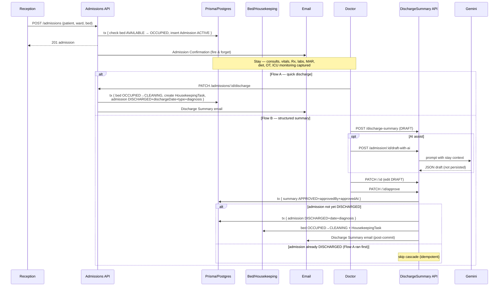

# Admission → Discharge Summary: Full Flow & Standards

> **Document purpose.** This document is the single source of truth for how a patient moves from "walks in the door" to "approved discharge summary" inside Ayphen HMS, what the current `DischargeSummary` entity actually captures, what enterprise hospital standards demand of a discharge summary, and where the gaps are. It ends with a concrete, prioritised sprint plan.
>
> All code references use markdown links of the form [file.ts:42](relative/path/file.ts#L42). Behaviour described as **"today"** is what the codebase does at the time of writing; behaviour marked **"recommended"** is not yet implemented.

---

## 1. The full flow in this codebase

The journey from arrival to discharge is split across roughly twenty Prisma models and six modules. The shape today is:

```
Reception → Admit → (Stay: consults, vitals, Rx, labs, MAR, diet, OT, ICU) → Discharge
                                                                              │
                                                                              ├─ Flow A: PATCH /admissions/:id/discharge   (quick)
                                                                              │
                                                                              └─ Flow B: POST /discharge-summary → PATCH /:id/approve
                                                                                          │
                                                                                          └─ (since commit 52b0f27) cascade matches Flow A
```

### 1.1 Admit — `POST /admissions`

**Endpoint:** `POST /admissions` → [admissions.controller.ts:24](backend/src/modules/admissions/admissions.controller.ts#L24)
**Service:** [admissions.service.ts:25-74](backend/src/modules/admissions/admissions.service.ts#L25)

**Input DTO** — [admit-patient.dto.ts:3-38](backend/src/modules/admissions/dto/admit-patient.dto.ts#L3):

| DTO field | Required | Notes |
|---|---|---|
| `patientId` | Yes | UUID v4. |
| `locationId` | No | Filled from `CurrentUser('locationId')` in the controller if missing — see [admissions.controller.ts:24](backend/src/modules/admissions/admissions.controller.ts#L24). |
| `wardId`, `bedId`, `admittingDoctorId`, `departmentId` | No | All optional UUIDs. |
| `admissionType` | No | Defaults to `'PLANNED'` in the service. |
| `diagnosisOnAdmission` | No (effectively required by Prisma) | The Prisma column is non-null. |
| `expectedDischargeDate` | No | Parsed via `new Date(...)`. |

Several fields are also consumed off `dto` directly without being on the DTO class — they pass through as `any` — `packageName`, `packageAmount`, `dailyBedCharge`, `preAdmissionChecklist` ([admissions.service.ts:44-47](backend/src/modules/admissions/admissions.service.ts#L44)).

**What is recorded** (in a single Prisma transaction wrapping `generateSequentialId`):

1. **Sequential admission number** generated as `ADM-${year}-NNN` ([admissions.service.ts:29](backend/src/modules/admissions/admissions.service.ts#L29)).
2. **Bed availability check** — if `bedId` provided, fetched `WHERE id=bedId AND tenantId AND status='AVAILABLE'`; throws `BadRequestException('Bed is not available')` if not found ([admissions.service.ts:32-34](backend/src/modules/admissions/admissions.service.ts#L32)).
3. **Bed flipped to `OCCUPIED`** ([admissions.service.ts:35](backend/src/modules/admissions/admissions.service.ts#L35)).
4. **Admission row inserted** with `status='ACTIVE'`, `admissionDate` defaulting via Prisma `@default(now())`, `admissionType='PLANNED'` if blank, `billingCleared=false`, `pharmacyCleared=false` ([admissions.service.ts:37-51](backend/src/modules/admissions/admissions.service.ts#L37)).

**Side effects after commit** (fire-and-forget; errors logged via `console.error`):

- Patient + tenant lookup.
- If `patient.email` is set → `sendEmail` to patient with HTML "Admission Confirmation" template ([admissions.service.ts:6-19](backend/src/modules/admissions/admissions.service.ts#L6)) containing the admission number, ward name, formatted date and admission type ([admissions.service.ts:56-71](backend/src/modules/admissions/admissions.service.ts#L56)).

**What admit does NOT do today (worth flagging):**

- No housekeeping task on admit (housekeeping only fires on discharge).
- No invoice/bed-charge line created on admit. Bed charges accrue via a separate `POST /admissions/bed-charges` cron-like endpoint ([admissions.service.ts:143-172](backend/src/modules/admissions/admissions.service.ts#L143)).
- No audit log entry.
- No SMS to admitting doctor.
- No `dailyBedCharge` validation.
- No cross-check that the chosen `bedId` actually belongs to the chosen `wardId`.
- No denormalised ward occupancy counter.

### 1.2 During the stay — what is captured against the admission

Inpatient data is scattered across ~20 Prisma models. Crucially, **only some carry a direct `admissionId` FK**. The rest must be re-attributed to the admission by querying `patientId` + the admission's date window — a brittle pattern for re-admissions on the same day.

| Domain | Model (schema.prisma) | `admissionId` column? | Required? |
|---|---|---|---|
| Consultation | [`Consultation`](backend/prisma/schema.prisma#L522) (L522-551) | **No** | Linked by `patientId` + `startedAt` ∈ admission window |
| Diagnoses | [`ConsultationDiagnosis`](backend/prisma/schema.prisma#L553) (L553-564) | No | Transitive via `consultationId` |
| Vitals | [`Vital`](backend/prisma/schema.prisma#L714) (L714-741) | Yes (nullable) | Set via service `dto.admissionId` ([vitals.service.ts:18](backend/src/modules/vitals/vitals.service.ts#L18)) |
| Prescription | [`Prescription`](backend/prisma/schema.prisma#L566), [`PrescriptionItem`](backend/prisma/schema.prisma#L591) | **No** | Linked by `patientId` + `issuedAt` window |
| Lab order | [`LabOrder`](backend/prisma/schema.prisma#L615), [`LabOrderItem`](backend/prisma/schema.prisma#L636) | **No** | Linked by `patientId` + `orderedAt` window |
| Lab result | [`LabResult`](backend/prisma/schema.prisma#L650), [`LabResultItem`](backend/prisma/schema.prisma#L672) | No | Transitive via `LabOrder` |
| MAR | [`MedicationAdministration`](backend/prisma/schema.prisma#L1125) (L1125-1149) | **Yes** | **Required** — service queries `getMARForAdmission` |
| Medication reconciliation | [`MedicationReconciliation`](backend/prisma/schema.prisma#L1151) (L1151-1166) | **Yes** | **Required** |
| Diet order | [`DietOrder`](backend/prisma/schema.prisma#L3036), [`DietMeal`](backend/prisma/schema.prisma#L3066) | **Yes** | **Required** on `DietOrder` |
| Wound assessment | [`WoundAssessment`](backend/prisma/schema.prisma#L1636) (L1636-1661) | Yes (nullable) | Optional |
| Antibiotic stewardship | [`AntibioticUsage`](backend/prisma/schema.prisma#L1663) (L1663-1687) | Yes (nullable) | Optional |
| Blood transfusion | [`BloodTransfusion`](backend/prisma/schema.prisma#L2215) (L2215-2240) | Yes (nullable) | Optional |
| Palliative care | [`PalliativeCareRecord`](backend/prisma/schema.prisma#L1689) | Yes (nullable) | Optional |
| ICU monitoring | [`IcuMonitoring`](backend/prisma/schema.prisma#L2426) (L2426-2474) | **Yes** | **Required** — intake/output, ventilator, APACHE-II, SOFA |
| ICU rounds | [`IcuRound`](backend/prisma/schema.prisma#L2534) (L2534-2554) | **Yes** | **Required** |
| OT booking | [`OTBooking`](backend/prisma/schema.prisma#L1012) (L1012-1054) | Yes (nullable) | Optional (null = day-care/OPD surgery) |
| Anaesthesia | [`AnaesthesiaRecord`](backend/prisma/schema.prisma#L2476) (L2476-2503) | No (via `bookingId`) | Transitive |
| Pre-op | [`PreOpAssessment`](backend/prisma/schema.prisma#L2505) (L2505-2532) | No (via `bookingId`) | Transitive |
| Shift handover | [`ShiftHandover`](backend/prisma/schema.prisma#L2030) (L2030-2055) | **No** | Ward/shift-level only; per-patient data lives inside `patientSummary` JSON |
| Discharge summary | [`DischargeSummary`](backend/prisma/schema.prisma#L2093) (L2093-2122) | **Yes** | **Required, unique per admission** |

**Key gaps surfaced by this map:**

- **Three high-volume inpatient flows do not carry `admissionId`** — Consultations, Prescriptions and LabOrders. Attribution requires `WHERE patientId = X AND (startedAt|issuedAt|orderedAt) BETWEEN admission.admissionDate AND COALESCE(admission.dischargeDate, NOW())`. Brittle for: same-day re-admissions, OPD-then-admit flows, transfers across locations.
- **`ShiftHandover` has no `admissionId` or `patientId` column.** Per-patient nursing handover for a specific admission has to be parsed out of `patientSummary` JSON. There is no dedicated nursing-note-per-admission table.
- **No generic `IntakeOutput` model for non-ICU wards.** ICU I/O is captured in `IcuMonitoring.urineOutputMl` + `intakeOutputBalance` + `infusions JSON`; general ward I/O has no model at all.
- **No generic `Procedure` table.** Bedside procedures (central lines, lumbar punctures, cardioversions) have to be recorded as `IcuRound.assessment`/`plan` free text or hidden inside `WoundAssessment`.

### 1.3 Two discharge paths

#### Flow A — Quick discharge

**Endpoint:** `PATCH /admissions/:id/discharge` → [admissions.controller.ts:28](backend/src/modules/admissions/admissions.controller.ts#L28)
**Service:** [admissions.service.ts:174-213](backend/src/modules/admissions/admissions.service.ts#L174)

Inside one transaction:

1. Loads admission with `patient, ward, bed`; 404 if missing.
2. If `bedId` is set: bed status → `'CLEANING'` (housekeeping flips it back later).
3. Auto-creates a `HousekeepingTask`: `taskType='BED_CLEANING'`, `priority='HIGH'`, `status='PENDING'`, `roomOrArea="<ward> — Bed <bedNumber>"`, description names the patient and admission number ([admissions.service.ts:182-190](backend/src/modules/admissions/admissions.service.ts#L182)).
4. Updates the admission: `status='DISCHARGED'`, `dischargeDate=now`, `dischargeType=dto.dischargeType`, `dischargeDiagnosis=dto.dischargeDiagnosis`, `dischargeSummary=dto.dischargeSummary` (the free-text field on the admission row — **not** a `DischargeSummary` row).

Post-transaction (non-blocking, errors logged via `console.error`):

- If `patient.email` set, looks up tenant org name and `sendEmail` with HTML "Discharge Summary" template containing date, type, optional diagnosis and the free-text summary.

Flow A is a fast lane intended for unremarkable discharges where a full structured summary is not warranted. It does not create a `DischargeSummary` row.

#### Flow B — Structured discharge summary

**Step 1 — Create draft.** `POST /discharge-summary` → [discharge-summary.controller.ts:30](backend/src/modules/discharge-summary/discharge-summary.controller.ts#L30) → service `create` ([discharge-summary.service.ts:36-65](backend/src/modules/discharge-summary/discharge-summary.service.ts#L36)).

- App-level pre-check using compound unique key `tenantId_admissionId` → `BadRequestException('Discharge summary already exists for this admission')` if one already exists ([discharge-summary.service.ts:37-40](backend/src/modules/discharge-summary/discharge-summary.service.ts#L37)).
- Persists `status='DRAFT'`, `preparedById=userId`. Date fields coerced to `Date`.

**Step 1.5 (optional) — AI draft.** `POST /discharge-summary/admission/:admissionId/draft-with-ai` → [discharge-summary.controller.ts:54](backend/src/modules/discharge-summary/discharge-summary.controller.ts#L54) → service `draftWithAi` ([discharge-summary.service.ts:189-333](backend/src/modules/discharge-summary/discharge-summary.service.ts#L189)).

- Pulls admission, consultations, prescriptions and lab orders inside the admission window.
- Sends prompt to Gemini with `feature='DISCHARGE_SUMMARY'`, `referenceType='ADMISSION'`, `referenceId=admission.id`, `maxOutputTokens=2048`.
- Returns the parsed JSON draft (matching the 9 AI-fillable fields). **No row is written** — the FE submits via the regular `POST` to persist.

**Step 2 — Update.** `PATCH /discharge-summary/:id` → service `update` ([discharge-summary.service.ts:67-75](backend/src/modules/discharge-summary/discharge-summary.service.ts#L67)). **APPROVED records are immutable** — line 70 throws.

**Step 3 — Approve.** `PATCH /discharge-summary/:id/approve` → service `approve` ([discharge-summary.service.ts:77-171](backend/src/modules/discharge-summary/discharge-summary.service.ts#L77)).

#### How commit 52b0f27 wires the two flows together

The `approve` cascade was rebuilt so that the end state is **identical** to Flow A. Either entry point produces:

- `Admission.status='DISCHARGED'` with `dischargeDate` set.
- Bed `'CLEANING'`.
- A `HousekeepingTask` of identical shape pending for the bed.
- Patient discharge email sent (if email on file).

The key alignment moves were:

1. **Whole approval wrapped in one `prisma.$transaction`** ([discharge-summary.service.ts:83](backend/src/modules/discharge-summary/discharge-summary.service.ts#L83)) — prevents a half-discharged state on partial failure.
2. **Idempotent** ([discharge-summary.service.ts:89-91](backend/src/modules/discharge-summary/discharge-summary.service.ts#L89)) — re-approving an already-APPROVED summary is a no-op.
3. **Cross-flow guard** ([discharge-summary.service.ts:103-106](backend/src/modules/discharge-summary/discharge-summary.service.ts#L103)) — if admission is already `DISCHARGED` (Flow A already ran), the approve records the approval and skips the bed/housekeeping/email cascade. This makes Flow A → Flow B safe (no double bed-flip, no duplicate housekeeping task).
4. **Email queued inside the transaction, sent post-commit** ([discharge-summary.service.ts:139-150](backend/src/modules/discharge-summary/discharge-summary.service.ts#L139), [discharge-summary.service.ts:153-168](backend/src/modules/discharge-summary/discharge-summary.service.ts#L153)) — the email only fires if the commit succeeds.



### 1.4 What `approve()` cascades — exhaustive

In execution order ([discharge-summary.service.ts:77-171](backend/src/modules/discharge-summary/discharge-summary.service.ts#L77)):

1. Mark summary `status='APPROVED'`, `approvedById=userId`, `approvedAt=now` (lines 93-96).
2. Load admission with `patient, ward, bed` (lines 98-101).
3. If admission already `DISCHARGED` (Flow A ran) → early-return, recording only the approval (lines 103-106).
4. Otherwise update the admission (lines 108-116):
   - `status='DISCHARGED'`
   - `dischargeDate = rec.dischargeDate || new Date()`
   - `dischargeDiagnosis = rec.diagnosisOnDischarge` **only if the admission did not already have one** (line 113).
5. If bed is `OCCUPIED` (extra guard vs Flow A which blindly flips), set bed to `'CLEANING'` and create a `HousekeepingTask` with the same shape as Flow A (lines 119-137).
6. Load tenant org name via `tradeName || legalName || "Hospital"` (lines 139-143).
7. Post-commit, if patient email is set, send "Discharge Summary - <orgName>" email containing patient name, discharge date (formatted `en-IN`), admission number, optional discharge diagnosis and optional follow-up instructions (lines 154-168). Errors logged via `this.logger.error` (not `console.error` — Flow A still uses `console.error`; minor logging drift).

---

## 2. What this app's `DischargeSummary` captures TODAY

Source: [schema.prisma:2093-2122](backend/prisma/schema.prisma#L2093).

| Field | Type | Optional | What it represents | Who fills it (today) |
|---|---|---|---|---|
| `id` | `String` (uuid) | No | Primary key | System |
| `tenantId` | `String` | No | Multi-tenant scope | System (from JWT) |
| `locationId` | `String` | No | Hospital branch | System (from JWT user `locationId`) |
| `admissionId` | `String` | No | Foreign key to the admission. Part of `@@unique([tenantId, admissionId])`. | System (FE passes) |
| `patientId` | `String` | No | Patient | System (FE passes) |
| `doctorId` | `String` | No | Responsible clinician (the clinical author) | Doctor (FE choice) |
| `admissionDate` | `DateTime` | No | Date patient was admitted (copied from admission at create time) | System |
| `dischargeDate` | `DateTime` | Yes | Date of discharge | Doctor / system at approve |
| `diagnosisOnAdmission` | `String` | No | Working diagnosis at admission | AI / Doctor (copied from admission) |
| `diagnosisOnDischarge` | `String` | Yes | Final diagnosis at discharge | AI / Doctor |
| `proceduresPerformed` | `Json` | Yes | List of procedures (structured) | AI / Doctor (OT auto-stamps if booking has `admissionId`) |
| `treatmentGiven` | `String` | Yes | Narrative of treatment delivered | AI / Doctor |
| `investigationSummary` | `String` | Yes | Summary of labs/imaging done | AI / Doctor |
| `conditionAtDischarge` | `String` | Yes | One of `STABLE / IMPROVED / UNCHANGED / WORSENED / DAMA / EXPIRED` | AI / Doctor |
| `dischargeMedications` | `Json` | Yes | Array of `{drug, dosage, frequency, duration}` | AI / Doctor |
| `followUpInstructions` | `String` | Yes | Free-text follow-up plan | AI / Doctor |
| `followUpDate` | `DateTime` (`@db.Date`) | Yes | Follow-up visit (date only) | Doctor |
| `dietaryAdvice` | `String` | Yes | Diet instructions | AI / Doctor |
| `activityRestrictions` | `String` | Yes | Activity restrictions post-discharge | AI / Doctor |
| `status` | `String` | No (default `"DRAFT"`) | Lifecycle — `DRAFT` or `APPROVED` | System |
| `preparedById` | `String` | Yes | User who created the draft | System (on create) |
| `approvedById` | `String` | Yes | User who approved | System (on approve) |
| `approvedAt` | `DateTime` | Yes | Approval timestamp | System |
| `createdAt` | `DateTime` | No (default `now()`) | Row creation | System |
| `updatedAt` | `DateTime` | No (`@updatedAt`) | Last modification | System (Prisma) |

**Constraints in force today:**

- `@@unique([tenantId, admissionId])` — one summary per admission, enforced both at the DB and at the application layer (pre-check + clean `400`).
- Lifecycle is one-way: `DRAFT → APPROVED`. There is **no DELETE handler** on the controller and no `cancel`/`reject` method.
- `APPROVED` records are immutable (`PATCH` throws `BadRequestException`).

**Notable absent fields** (covered in §5 gap analysis): MRN/UHID, ward/bed at discharge, allergies, principal vs secondary ICD codes, pending investigations, code status, MLC flag, immunisations given, functional status, vital signs at discharge, weight at discharge, vaccinations given, smoking-cessation counselling.

---

## 3. Enterprise hospital standards — what a discharge summary MUST contain

This section is grouped by content area. Each row notes which standard requires it (NABH = National Accreditation Board for Hospitals India 5th ed. AAC.14; TJC = The Joint Commission RC.02.04.01; JCI = Joint Commission International ACC.3 / MCI.19; CMS = US 42 CFR 482.24; PRSB = UK Professional Record Standards Body eDischarge Summary Standard).

### 3.1 Identification

| Item | Standards |
|---|---|
| Patient full name | NABH AAC.14, CMS 482.24(c), JCI MCI.19, PRSB (mandatory) |
| Unique patient identifier (MRN / UHID) | NABH AAC.14, JCI MCI.19, PRSB (mandatory) |
| Date of birth / age / sex | CMS 482.24(c), JCI MCI.19, PRSB (mandatory) |
| GP / primary care details | PRSB (mandatory), JCI ACC.3 |
| Insurance / payer | CMS 482.24(c) |

### 3.2 Stay / Episode Details

| Item | Standards |
|---|---|
| Date of admission | NABH AAC.14, CMS 482.24(c)(4)(i), JCI MCI.19, TJC RC.02.04.01 |
| Date of discharge | NABH AAC.14, CMS 482.24, PRSB (required) |
| Admitting / attending physician | NABH AAC.14, CMS 482.24(c)(2)(vii), TJC RC.02.04.01 |
| Ward / unit / bed | PRSB (required), JCI clinical record |
| Admission source (emergency / elective / referral) | PRSB (required), JCI ACC.3 |
| Reason for admission / chief complaint | NABH AAC.14, TJC RC.02.04.01, JCI ACC.3, CMS 482.24(c)(4)(v), PRSB |

### 3.3 Clinical Content

| Item | Standards |
|---|---|
| Principal / final diagnosis (ICD-coded) | NABH AAC.14, CMS 482.24(c)(4)(v), TJC RC.02.04.01, JCI MCI.19, AHIMA/ICD-10 Official Guidelines |
| Secondary / comorbid diagnoses (ICD-coded) | AHIMA CDI, CMS 482.24(c)(4)(iv), JCI MCI.19 |
| Significant clinical findings (labs, imaging, vitals) | NABH AAC.14, TJC RC.02.04.01, JCI MCI.19 |
| Procedures performed with dates | NABH AAC.14, CMS 482.24(c)(4)(v), TJC RC.02.04.01, PRSB (recommended) |
| Hospital course narrative | NABH AAC.14, TJC RC.02.04.01, CMS 482.24(c)(4)(v) |
| Complications / adverse reactions / HAIs | CMS 482.24(c)(4)(iii), TJC RC.02.04.01, JCI MCI.19 |
| Condition at discharge | NABH AAC.14, TJC RC.02.04.01, CMS 482.24(c)(4)(v), JCI ACC.3, PRSB |
| Allergies and adverse reactions | PRSB (mandatory), JCI MCI.19 |
| Cause of death (if applicable) | NABH AAC.14, WHO ICD, CMS 482.24 |

### 3.4 Medications

| Item | Standards |
|---|---|
| Discharge medications (name, dose, route, frequency) | NABH AAC.14, TJC RC.02.04.01 / IPSG.3, JCI ACC.3, PRSB |
| New medications started (with indication) | TJC IPSG.3, JCI MCI.19, AHIMA CDI |
| Medications changed or discontinued (with reason) | TJC IPSG.3, AHIMA CDI, PRSB |
| Medications administered during stay | NABH AAC.14 |

### 3.5 Follow-up & Continuity

| Item | Standards |
|---|---|
| Follow-up appointments (who, when, where) | NABH AAC.14, CMS 482.24(c)(4)(v), TJC RC.02.04.01, JCI ACC.3, PRSB (required) |
| Pending investigations / outstanding results | PRSB (required), JCI ACC.3 |
| Discharge destination (home / SNF / rehab / transfer) | CMS 482.24(c)(4)(v), TJC RC.02.04.01, JCI ACC.3, PRSB |
| Referrals to other services | PRSB, JCI ACC.3 |
| Activity / diet / wound care restrictions | NABH AAC.14, CMS 482.24(c)(4)(v) |
| When to seek urgent / emergency care | NABH AAC.14 (explicit) |

### 3.6 Patient / Carer Education

| Item | Standards |
|---|---|
| Information given to patient and family | TJC RC.02.04.01, JCI ACC.3, NABH AAC.14 |
| Patient / carer concerns, expectations, wishes | PRSB (required) |
| Individual communication / language / cultural needs | PRSB (required) |
| Written, understandable discharge instructions | NABH AAC.14, CMS 482.24(c)(4)(v), TJC RC.02.04.01 |

### 3.7 Legal / Safety / Administrative

| Item | Standards |
|---|---|
| Legal information (consent, PoA, safeguarding, DoLS) | PRSB (required) |
| Safety alerts / risks to self or others | PRSB (required) |
| Discharge against medical advice (DAMA) note | NABH AAC.14 (explicit) |
| Distribution list (copies to GP, specialists, patient) | PRSB (required), JCI ACC.3 |

### 3.8 Authentication & Completion

| Item | Standards |
|---|---|
| Author / person completing the record (name, role, contact) | PRSB (mandatory), JCI MCI.19, TJC RC.01.02.01 |
| Treating / responsible clinician | NABH AAC.14, CMS 482.24(c)(2)(vii), JCI MCI.19 |
| Date/time of summary completion | CMS 482.24(c)(4)(v) — within 30 days of discharge; TJC RC.02.04.01 |
| Countersignature / supervising consultant | JCI MCI.19 — trainee records must be reviewed/authenticated |

### 3.9 Timeliness mandates

- **CMS 42 CFR 482.24(c)(4)(v):** discharge summary must be completed within 30 days post-discharge.
- **TJC RC.02.04.01:** completion time defined by hospital policy (typically 30 days).
- **NABH AAC.14:** summary provided to patient at time of discharge.
- **JCI MCI.19:** time frame defined by hospital policy.
- **PRSB / NHS:** electronic discharge sent within 24 hours is the NHS target standard.

---

## 4. Best-practice enterprise additions (beyond regulatory minimum)

Items that show up consistently in Cleveland Clinic, NHS PRSB, and Apollo-style templates. These improve continuity of care but are not, strictly, accreditation-mandated.

### 4.1 Medication reconciliation in four buckets

Not just a list of discharge meds, but a reconciled view: **NEW** / **CHANGED** / **STOPPED** / **CONTINUED**, each with an indication. Cleveland Clinic and PRSB both require this structure; AHRQ research shows discharge handover quality drops sharply without it.

### 4.2 Pending investigations at discharge

Explicit list of tests whose results were not back at the time of discharge, with the owner who will follow them up. AHRQ research: this is missing from ~65% of real discharge summaries — the **single highest-risk gap**.

### 4.3 Red-flag warning signs in plain language

Patient-facing: "Return to the ER if chest pain, shortness of breath, fever above 38.5C, ...". NABH explicitly requires "when and how to obtain urgent care" — best-practice expands this into a structured plain-language list at patient reading level.

### 4.4 Functional status / Barthel Index at discharge

Mobility level (independent / assisted / dependent) — critical for handover to step-down facilities and home care. Absent in 33–92% of real summaries.

### 4.5 Code status / DNR / DNAR

Recorded with date of decision and the person who made it. Crucial if the patient re-presents in extremis.

### 4.6 Infection-control flags

MRSA carrier, VRE, C. diff, COVID etc. — must be flagged for any receiving facility.

### 4.7 Wound / pressure ulcer status

Stage, site, dressing currently in use, date of last dressing change.

### 4.8 Immunisations administered during admission

Flu, pneumococcal, tetanus booster — closes the loop with the GP record.

### 4.9 Counselling delivered

Smoking cessation, alcohol, substance use, contraception, dietary counselling — yes/no plus referral made.

### 4.10 Vital signs and weight at discharge

A snapshot — last set of vitals before walking out and weight (essential for paediatric and renal patients).

### 4.11 Patient / carer concerns and individual requirements

PRSB-mandated free-text capturing the patient's own concerns and any individual needs (language, communication, cognitive impairment).

### 4.12 Distribution list

Explicit list of who is receiving a copy — GP, specialist, patient, payer.

### 4.13 Patient education materials given

Booklets, links, leaflet codes — recorded so the GP knows what the patient was told.

### 4.14 MLC / police case flag

For India practice: FIR number, police station, forensic opinion reference. Apollo template has this; NABH expects it where applicable.

### 4.15 Clinical trial participation

If the patient was enrolled in a study during the stay, the trial identifier and the responsible PI go on the summary.

---

## 5. Gap analysis — Ayphen HMS vs enterprise standard

Y = present and usable. **Partial** = data exists somewhere in the model graph but is not a first-class field on `DischargeSummary` (so the FE does not surface it or the AI does not fill it). N = absent.

| Standard item | Covered today | Where it lives | Recommended action |
|---|---|---|---|
| **Identification** | | | |
| Patient name | Y | `DischargeSummary.patientId → Patient.firstName/lastName` | — |
| MRN / UHID on summary row | Partial | `Patient.patientId` (not denormalised on summary) | Denormalise into a printable header at render time (FE); no schema change needed |
| Date of birth / age / sex | Partial | `Patient` | Surface in FE PDF/print template |
| GP / primary care details | N | — | Optional: extend `Patient` with `gpName`, `gpContact` |
| Insurance / payer | Partial | `Patient.insurance*` if present | Surface in print template |
| **Stay details** | | | |
| Date of admission | Y | `DischargeSummary.admissionDate` | — |
| Date of discharge | Y | `DischargeSummary.dischargeDate` | — |
| Attending / responsible doctor | Y | `DischargeSummary.doctorId` | — |
| Ward / unit / bed at discharge | Partial | `Admission.wardId / bedId` (not on summary) | Denormalise `wardName`, `bedNumber` on the summary at approve time |
| Admission source (emergency/elective) | Partial | `Admission.admissionType` | Surface in print template |
| Reason for admission / chief complaint | Partial | First `Consultation.chiefComplaint` | Add `reasonForAdmission: String?` (denormalised at create) |
| **Clinical content** | | | |
| Principal diagnosis (ICD-coded) | Partial | `diagnosisOnDischarge` is **free text**; no ICD code field | Add `primaryIcdCode: String?` and store ICD on the summary |
| Secondary / comorbid diagnoses (coded) | N | — | Add `secondaryDiagnoses: Json?` (array of `{description, icdCode}`) |
| Significant clinical findings | Partial | `investigationSummary` (free text) | Acceptable — keep but augment with structured `keyResults: Json?` |
| Procedures performed with dates | Partial | `proceduresPerformed Json?`; OT auto-stamps when `OTBooking.admissionId` set ([ot.service.ts:703-753](backend/src/modules/ot/ot.service.ts#L703)) | Schema is fine; FE should render dates and CPT/procedure code per item |
| Hospital course narrative | Y | `treatmentGiven` | — |
| Complications / adverse reactions | N | — | Add `complications: String?` or `complications: Json?` |
| HAI (hospital-acquired infection) flag | N | — | Add `haiOccurred: Boolean`, `haiDetails: String?` |
| Condition at discharge | Y | `conditionAtDischarge` (STABLE / IMPROVED / UNCHANGED / WORSENED / DAMA / EXPIRED) | — |
| Allergies | N (on summary) | `Patient.allergies` exists | Denormalise `allergiesSnapshot: String?` on summary so historic record is preserved |
| Cause of death | N | `conditionAtDischarge = EXPIRED` exists but no cause | Add `causeOfDeath: String?` and `timeOfDeath: DateTime?` |
| **Medications** | | | |
| Discharge medications | Y | `dischargeMedications Json` | — |
| New / changed / stopped / continued buckets | Partial | All meds in one JSON blob | Change shape to `{ new: [], changed: [], stopped: [], continued: [] }` with `indication` per item |
| Medications administered during stay | Partial | `MedicationAdministration` table (linked by `admissionId`) | Acceptable — keep separate; PDF should summarise |
| **Follow-up & continuity** | | | |
| Follow-up appointments (who/when/where) | Partial | `followUpInstructions`, `followUpDate` | Add `followUpProvider: String?`, `followUpLocation: String?` |
| Pending investigations at discharge | **N** | — | **HIGH PRIORITY** — Add `pendingInvestigations: String?` (or `Json?` of `{test, expectedDate, owner}`) — biggest patient-safety gap |
| Discharge destination | Partial | `dischargeType` on `Admission` | Add `dischargeDestination: String?` on summary (`HOME`, `SNF`, `REHAB`, `TRANSFER_HOSPITAL`, `LAMA`, `EXPIRED`) |
| Referrals to other services | N | — | Add `referrals: Json?` (array of `{service, reason}`) |
| Activity / diet / wound care | Y | `activityRestrictions`, `dietaryAdvice` | — |
| When to seek urgent care (red flags) | N | — | Add `redFlagSymptoms: String?` (plain-language list) |
| **Patient / carer education** | | | |
| Information given to patient/family | N | — | Add `patientEducationProvided: Json?` (booklet codes, topics) |
| Patient / carer concerns | N | — | Add `patientCarerConcerns: String?` |
| Language / cultural needs | Partial | `Patient.preferredLanguage` if present | Surface in print template |
| **Legal / safety / administrative** | | | |
| DAMA documentation | Partial | `conditionAtDischarge = DAMA` value exists | Add `damaDetails: Json?` (risks counselled, witness signature, indemnity ref) |
| MLC / police case | N | — | Add `mlcFlag: Boolean`, `mlcDetails: Json?` (FIR no, station, IO name) |
| Code status / DNR | N | — | Add `codeStatus: String?` (`FULL`, `DNR`, `DNAR`), `codeStatusDecidedAt: DateTime?` |
| Safety alerts (suicide risk, fall risk) | N | — | Add `safetyAlerts: String[]` |
| Distribution list | N | — | Add `distributionList: String[]` (emails/copies sent) |
| **Authentication** | | | |
| Person completing the record | Y | `preparedById` | — |
| Treating clinician | Y | `doctorId` | — |
| Date/time of completion | Y | `approvedAt`, `updatedAt` | — |
| Countersignature (trainee → consultant) | N | — | Add `countersignedById: String?`, `countersignedAt: DateTime?` for trainee workflows |
| **Best-practice (non-regulatory)** | | | |
| Functional status / Barthel | N | — | Add `functionalStatus: String?` |
| Wound / pressure ulcer status | Partial | `WoundAssessment` model exists | Pull latest assessment into summary print, or add `woundStatusAtDischarge: String?` |
| Vital signs at discharge | Partial | `Vital` table | Pull latest set into summary print, or denormalise `vitalsAtDischarge: Json?` |
| Weight at discharge | Partial | `Vital.weight*` | Denormalise `weightAtDischargeKg: Decimal?` |
| Immunisations administered | N | — | Add `immunisationsGiven: Json?` |
| Smoking / alcohol / substance counselling | N | — | Add `counsellingGiven: String[]` |
| Infection-control flags (MRSA/VRE/C. diff) | N | — | Add `infectionControlFlags: String[]` |
| Clinical trial participation | N | — | Add `clinicalTrialId: String?` |
| Patient education materials given | N | — | Subsumed by `patientEducationProvided` above |
| **Timeliness** | | | |
| 24h / 30d completion timer | N | — | Add SLA tracker — `expectedCompletionBy: DateTime` defaulting to `dischargeDate + 24h`; surface a dashboard widget for overdue summaries |

**Highest-risk gaps in patient-safety terms:**

1. **Pending investigations at discharge** — missing on the entity, missing in the AI prompt. AHRQ research: absent in 65% of real summaries.
2. **Structured medication reconciliation** — today's `dischargeMedications` JSON is a flat list with no NEW/CHANGED/STOPPED/CONTINUED buckets and no `indication` per drug.
3. **Allergies snapshot** — pulled from the live `Patient` record at render time; not frozen on the summary. If `Patient.allergies` is edited post-discharge, the audit trail is broken.
4. **Code status, DAMA details, MLC flag** — none captured structurally; legal-risk surface area.
5. **Red-flag symptoms** — patient-facing plain-language list not present.

---

## 6. Recommended next sprint

Prioritised by patient-safety impact, ease of shipping, and standards-compliance pressure.

### HIGH priority — ship in the next sprint

1. **Add `pendingInvestigations: String?`** (or `Json?` of `{test, expectedDate, owner}`).
   - Schema: add column to `DischargeSummary`.
   - FE: required textarea or repeating row in the discharge summary form.
   - AI: add to `draftWithAi` prompt (pull from `LabOrder` rows in stay window where `status != 'COMPLETED'`).
   - Standards driver: PRSB (required), JCI ACC.3. AHRQ flags this as the #1 risk gap.

2. **Restructure `dischargeMedications` into NEW / CHANGED / STOPPED / CONTINUED buckets, each with `indication`.**
   - Schema: keep `Json` but enforce shape `{ new: [], changed: [], stopped: [], continued: [] }`.
   - FE: tabbed editor mirroring the four buckets; auto-seed from `MedicationReconciliation.discrepancies`.
   - AI: update prompt to populate buckets, not a flat list.
   - Standards driver: TJC IPSG.3, AHIMA CDI.

3. **Add `primaryIcdCode: String?` and `secondaryDiagnoses: Json?` (array of `{description, icdCode}`).**
   - Schema: two new columns.
   - FE: ICD code picker (autocomplete) on the form; reuse the `ConsultationDiagnosis` picker.
   - Standards driver: NABH AAC.14, CMS 482.24, JCI MCI.19.

4. **Add `complications: String?` and `haiOccurred: Boolean` + `haiDetails: String?`.**
   - Schema: three new columns.
   - FE: collapsible section "Complications & HAIs".
   - Standards driver: CMS 482.24(c)(4)(iii), TJC RC.02.04.01.

5. **Snapshot allergies onto the summary at create time — `allergiesSnapshot: String?`.**
   - Schema: one new column.
   - Service: populate from `Patient.allergies` inside `create`.
   - Standards driver: PRSB (mandatory), JCI MCI.19.

6. **Add `redFlagSymptoms: String?`.**
   - Schema: one new column.
   - FE: required textarea with placeholder "Return to ER if chest pain, shortness of breath, fever above 38.5C, ...".
   - Standards driver: NABH AAC.14 (explicit), patient-safety best practice.

7. **Add `dischargeDestination: String?`** with enum `HOME | SNF | REHAB | TRANSFER_HOSPITAL | LAMA | EXPIRED`.
   - Schema: one new column.
   - FE: dropdown linked to `Admission.dischargeType` via default.
   - Standards driver: CMS 482.24(c)(4)(v), TJC, JCI, PRSB.

### MEDIUM priority — sprint after

1. **DAMA support — `damaDetails: Json?`** capturing risks counselled, witness signature URL/text, indemnity reference. Required when `conditionAtDischarge = 'DAMA'`.
2. **MLC support — `mlcFlag: Boolean` + `mlcDetails: Json?`** (FIR number, police station, IO name, forensic opinion ref).
3. **Code status — `codeStatus: String?` (FULL/DNR/DNAR), `codeStatusDecidedAt: DateTime?`, `codeStatusDecidedById: String?`.**
4. **Follow-up structure — `followUpProvider: String?`, `followUpLocation: String?`** alongside existing `followUpDate`.
5. **Referrals — `referrals: Json?`** array of `{service, reason, urgency}`.
6. **Denormalise stay context onto the summary at create:** `wardName`, `bedNumber`, `admissionNumber`, `reasonForAdmission`. Avoids fragile joins at PDF render time.
7. **Vitals + weight at discharge — `vitalsAtDischarge: Json?` and `weightAtDischargeKg: Decimal?`.** Pull latest `Vital` row for the admission inside `create`.
8. **Patient/carer concerns — `patientCarerConcerns: String?`.**
9. **Distribution list — `distributionList: String[]`** (emails the summary was sent to). Also a foundation for HL7/FHIR send-out later.
10. **24h SLA tracker — `expectedCompletionBy: DateTime?`** defaulting to `dischargeDate + 24h` on admission discharge; dashboard widget for overdue summaries.

### LOW priority — backlog

1. **Functional status — `functionalStatus: String?`** (or Barthel sub-fields).
2. **Wound status at discharge — `woundStatusAtDischarge: String?`** (denormalised from latest `WoundAssessment`).
3. **Immunisations during stay — `immunisationsGiven: Json?`.**
4. **Counselling given — `counsellingGiven: String[]`** (smoking, alcohol, substance, contraception, diet).
5. **Infection-control flags — `infectionControlFlags: String[]`.**
6. **Trainee countersignature — `countersignedById: String?`, `countersignedAt: DateTime?`.** Enforce: cannot approve until countersigned if author role is trainee/junior.
7. **Clinical trial — `clinicalTrialId: String?`.**
8. **Patient education materials — `patientEducationProvided: Json?`** (booklet codes, links).
9. **Cause of death — `causeOfDeath: String?`, `timeOfDeath: DateTime?`** (when `conditionAtDischarge = 'EXPIRED'`).
10. **GP details on `Patient` — `gpName`, `gpContact`, `gpAddress`** to populate PRSB "GP practice" block.

### Cross-cutting (not field additions)

- **Wire `admissionId` onto Consultation, Prescription, LabOrder.** Today these are linked only by `patientId` + date window. Making `admissionId` a first-class nullable column on all three would eliminate the brittle window-query pattern and make AI drafting more accurate. **Migration plan:** add column nullable, backfill via the date-window query, then update the create paths in `consultations.service.ts`, `prescriptions.service.ts`, `lab.service.ts` to set it when the patient has an active admission.
- **Standardise logging across the two discharge flows.** Flow A uses `console.error`; Flow B uses `this.logger.error`. Move Flow A to the NestJS `Logger`.
- **Add an audit log entry on admit, discharge, and approve.** Currently no audit row is written for any of the three.
- **Add a one-click "Generate PDF" endpoint** with the printable rendering (header, identifiers, signature block) so the summary is shareable outside the app.
- **Replace `proceduresPerformed Json?` consumers with a structured `{name, code, date, performedBy, location, notes}` shape** if the OT auto-stamp is to evolve beyond a free-form text dump.

---
