# Ayphen HMS — Business Flow Charts
### May 2026

---

## 1. Platform Onboarding Flow

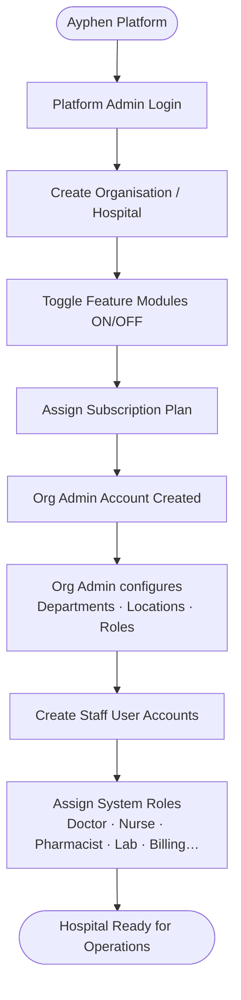

---

## 2. OPD Patient Journey

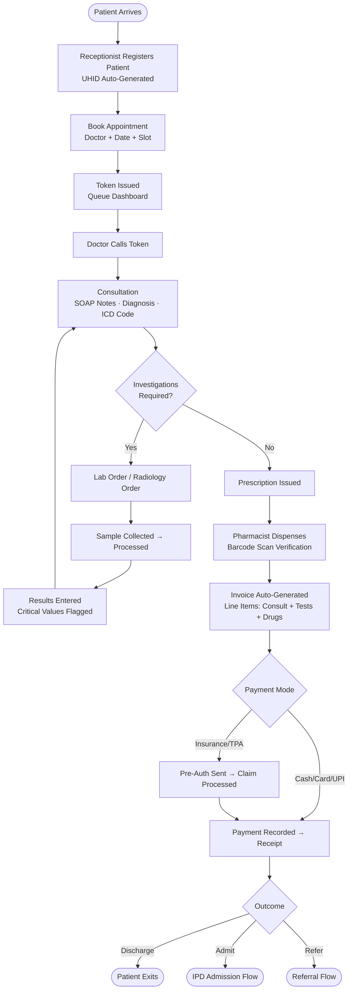

---

## 3. IPD Admission & Inpatient Flow

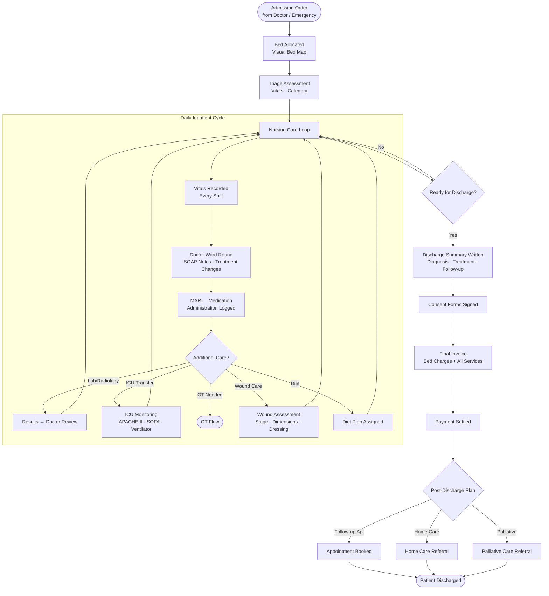

---

## 4. Emergency Department Flow

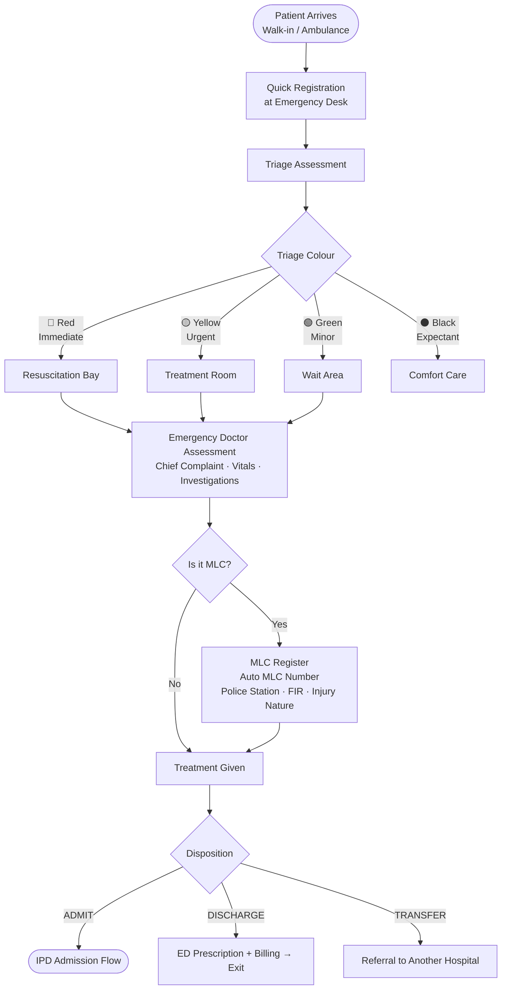

---

## 5. Operation Theatre Flow

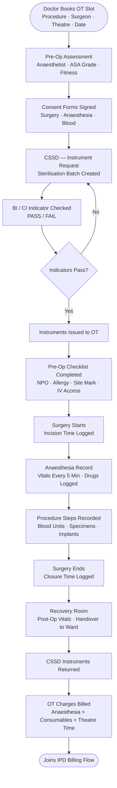

---

## 6. Pharmacy Flow

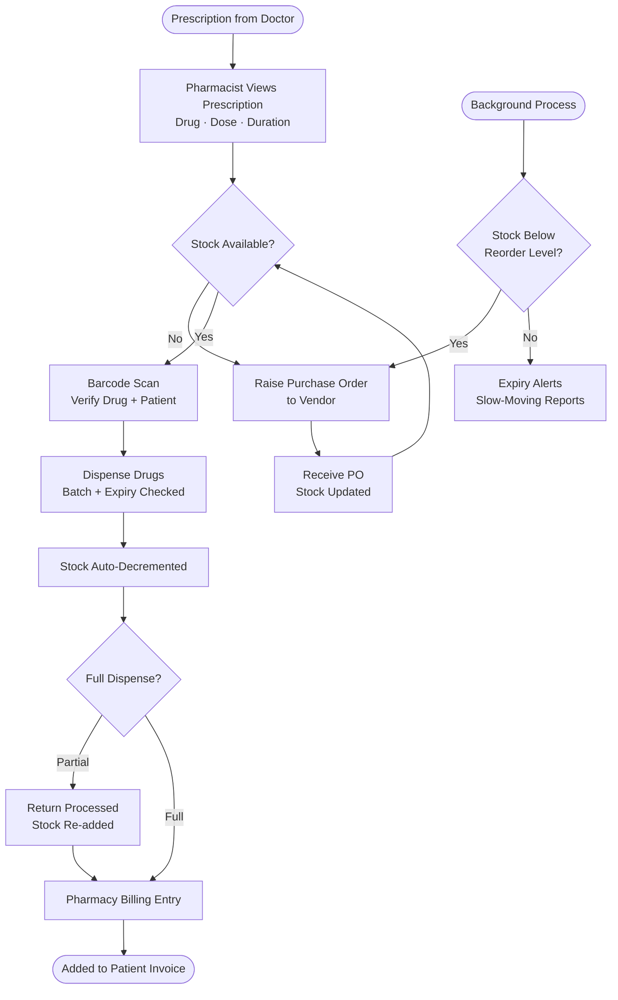

---

## 7. Laboratory Flow

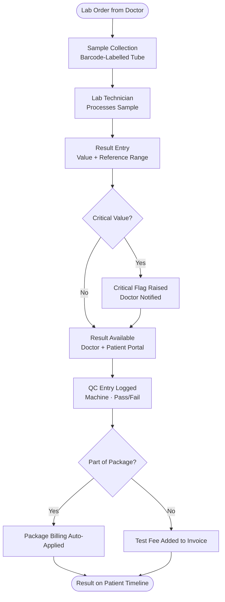

---

## 8. Billing & Insurance Flow

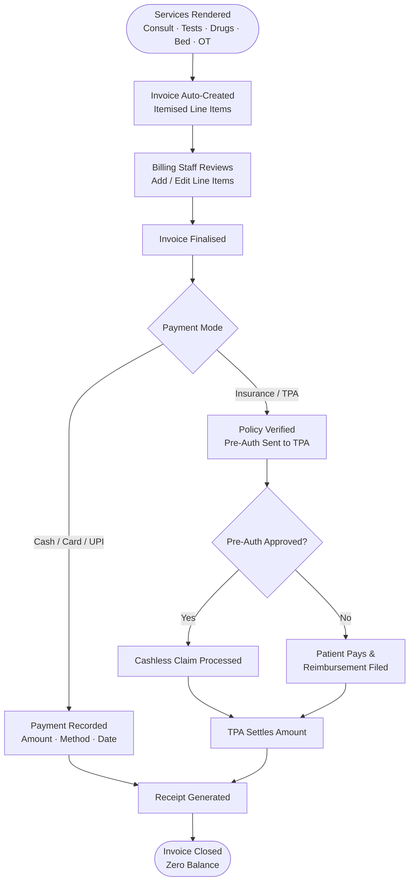

---

## 9. Staff Lifecycle Flow

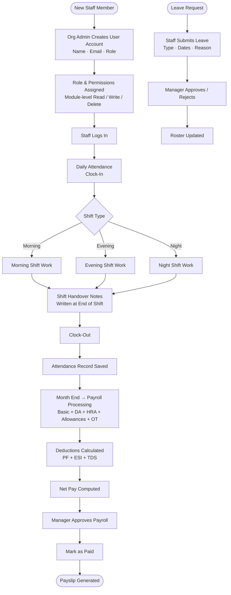

---

## 10. Patient Portal Flow

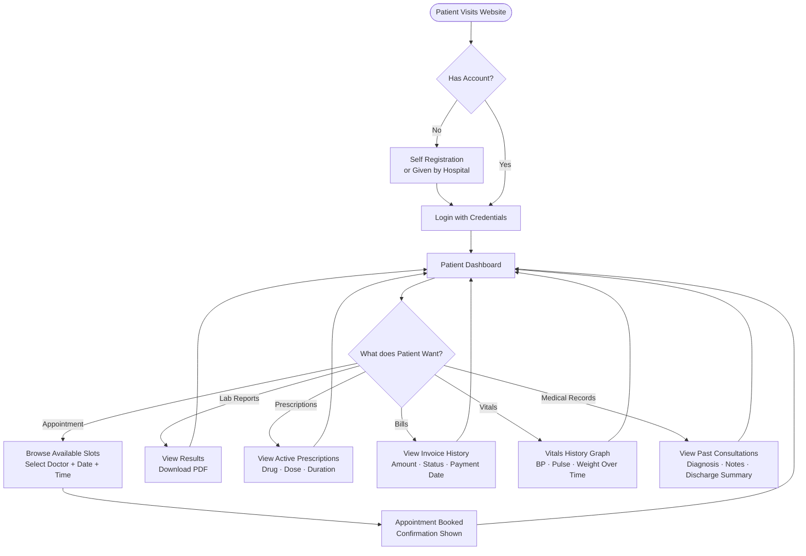

---

## 11. Quality & Compliance Flow

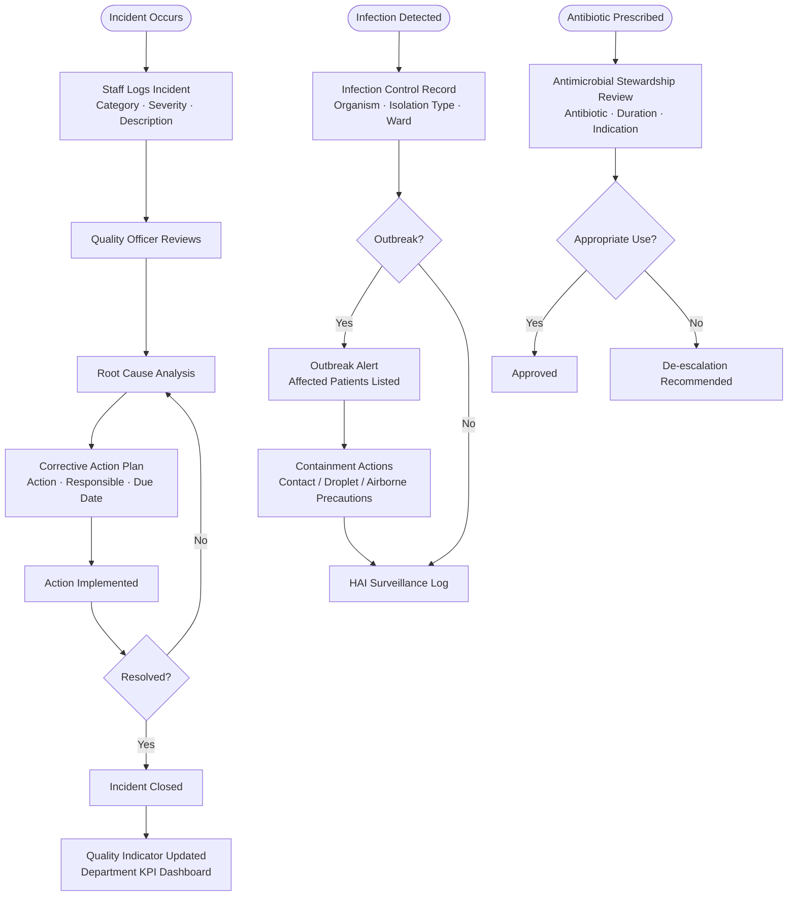

---

## 12. End-to-End Master Flow (Summary)

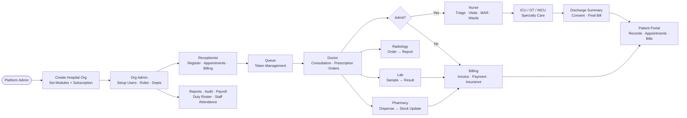
